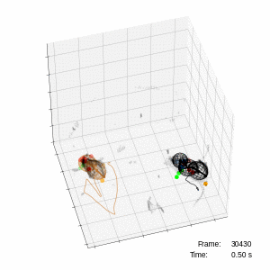

# 3DDD Social Mouse Tracker

# 
 Welcome to the <b>3D</b>, <b>D</b>eep-learning, <b>D</b>epth-video <b>Social Mouse Tracker</b>! 

<i>This is a placeholder code repo for: </i>

<a href="https://doi.org/10.1101/2020.05.21.109629">Ebbesen CL & Froemke RC (2021) Automatic mapping of multiplexed social receptive fields by deep learning and GPU-accelerated 3D videography. bioRxiv, doi: 10.1101/2020.05.21.109629.</a>

The code and analysis scripts will be available here when the manuscript is accepted.
